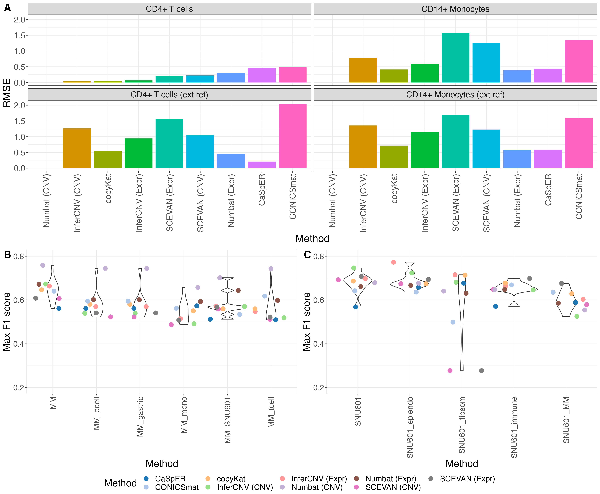

# Benchmarking scRNA-seq copy number variant callers

Katharina T. Schmid<sup>1</sup>, Aikaterini Symeonidi<sup>1,2</sup>, Dmytro Hlushchenko<sup>1</sup>, Maria L. Richter<sup>1</sup>, Andréa E. Tijhuis<sup>3</sup>, Floris Foijer<sup>3</sup>, Maria Colomé-Tatché<sup>1,2</sup> (contact: maria.colome@bmc.med.lmu.de)

1 Biomedical Center (BMC), Physiological Chemistry, Faculty of Medicine, LMU Munich, Planegg-Martinsried, Germany

2 Institute of Computational Biology, Computational Health Center, Helmholtz Zentrum München, German Research Center for Environmental Health, Neuherberg, Germany

3 European Research Institute for the Biology of Ageing, University of Groningen, University Medical Center Groningen, Groningen, The Netherlands

The preprint of this study is available here:
https://doi.org/10.1101/2024.12.18.629083

The following README contains:

1. [Project description](#project-description)
2. [Main results](#main-results)
3. [Setup of the pipeline](#setup-of-the-pipeline)
4. [Running the pipeline](#running-the-pipeline)

## Project description

We evaluated six popular computational methods in their ability to detect CNVs in 21 scRNA-seq datasets, comprising cancer cell lines, primary cancer samples and one diploid PBMC dataset. We assessed the methods according to their ability to recover the ground truth CNVs, estimaed with (sc)WGS or WES, using a large set of performance metrics. Additionally, we explored whether they could correctly identify euploid cells, especially also in fully diploid samples, and subclonal structures in heterogeneous tumor samples. We assessed also the scalability of each method.

<figure>
  
  <figcaption><b>Figure 1.</b> Overview schematics of benchmarking workflow. Input data in blue, evaluation results in pink.</figcaption>
</figure>
</br></br>
Assessed methods (and tested versions):

* CaSpER (v0.2.0): https://github.com/akdess/CaSpER

* CONICSmat (v0.0.0.1): https://github.com/diazlab/CONICS

* copyKat (v1.1.0): https://github.com/navinlabcode/copykat 

* InferCNV (v1.10.0): https://github.com/broadinstitute/infercnv

* Numbat (v1.4.0): https://github.com/kharchenkolab/numbat/

* SCEVAN (v1.0.1): https://github.com/AntonioDeFalco/SCEVAN 


## Main results

For the CNV analysis of aneuploid samples, the evaluated methods showed a very variable performance which was in large part dataset dependent (Figure 2). We identified certain dataset characteristics that impacted the performance, e.g. total coverage, number of measured cells, and the relative frequency of gains and losses.

<figure>
  
  <figcaption><b>Figure 2.</b> General performance evaluation on aneuploid datasets. <b>(A)</b> Performance comparison across all datasets. Due to lack of genomic information, the ALL1, ALL2 and mouse data was not run with CaSpER and Numbat. For the dataset A375, CaSpER identified no CNVs, for HCT116, Numbat (CNV) identified no CNVs. <b>(B)</b> Impact of dataset characteristics on the performance (maximal F1 scores). The features here show the total number of UMI counts, the number of cells and the number of expressed genes in the cancer dataset, the mean dropout rate per cell, the mean coefficient of variation across genes, the fraction of gained regions from all ground truth annotated regions and the fraction of CNV regions (gained and lost together). These are the top 7 general dataset characteristics with the highest mean absolute correlation to the performance. <b>(C)</b> Method comparison within the SNU601 dataset. <b>(D)</b> Karyogram of the SNU601 dataset, every method score was scaled to have the same standard deviation.</figcaption>
</figure>
</br></br>

A strong difference between methods was instead observed in the analysis of the diploid cells (T-cells from a PBMC dataset), where the choice of the reference dataset had a great effect (Figure 3A). When using T-cells from the same dataset as reference, we observed good performance values for all methods. However, when we used Monocytes or T-cells from another dataset for normalization, Numbat and Casper outperformed other methods, potentially due to the inclusion of allelic information for CNV classification. Also for aneuploid samples, the choice of the reference dataset had an effect (Figure 3B+C). If cells from the same sample are available, they tend to be the best reference dataset.
</br></br>

<figure>
  
  <figcaption><b>Figure 3.</b> <b>(A)</b> Root mean squared error (RMSE) between CNV predictions of each method and diploid baseline as ground truth. The methods with lowest RMSE perform best. Panel title shows chosen reference cells. <b>(B+C)</b> Performance of the methods with different reference datasets for the MM dataset (B) and the SNU601 dataset (C). For the MM dataset, we tested a second healthy PBMC dataset, which we split into B cells, T cells and Monocytes (mono). We additionally tested a healthy gastric dataset and a gastric cancer dataset (SNU601). For the SNU601, we tested a second healthy gastric reference, which we split into three groups, epithelial and endothelial cells (epiendo), fibroblasts and smooth muscle cells (fibsom) and immune cells. We also tested the MM dataset as reference.</figcaption>
</figure>
</br></br>
Furthermore, the methods differ in other several other aspects (Figure 4). Numbat, SCEVAN and copyKat all include the option to automatically annotate diploid cells. The automatic performance showed a very high concordance to the manual annotations in most cases, with Numbat performing the best. The classification of cells into different subclones worked well for all methods except CONCISmat and CaSpER. The runtime requirements for Numbat and Casper are longer, as they also estimate allele frequencies compared to the other methods, as well as for InferCNV. Especially CONICSmat and copyKat show both a fast runtime and little memory requirements. In the end, there is not one scRNA-seq method outperforming all other methods, but the user should choose the appropriate method for their specific tasks.
</br></br>
<figure>
  
  <figcaption><b>Figure 4.</b> Summary of the benchmarking results. Main categories: mean CNV prediction performance for the different cancer datasets (human droplet-based, human plate-based and mouse droplet-based) and diploid datasets, tumor cell classification, sub clonal identification and required resources. The dot size shows the rank of each method for the respective column, with 1 being the best performing method in the category. The dot color represents a normalized score, where the values of each metric are scaled from 0 to 1, in a way that 1 is always the best value. For this, the values of RMSE, runtime and memory consumption were inverted.</figcaption>
</figure>

## Setup of the pipeline

All CNV callers are implemented in R. For this reason, the complete benchmarking is performed in R. The required packages were installed using this [conda environment](https://docs.conda.io/en/latest/), documented in the yaml file `conda_env_R.yml`. The environment is based on R4.1.0 and contains also `snakemake` for the benchmarking pipeline (see below).

```
conda env create -f conda_env_R.yml
conda activate r_env
```

If conda is slow in creating the environment, [mamba](https://mamba.readthedocs.io/en/latest/user_guide/mamba.html) is a great extension.

However, most of the CNV callers are only available on github. They need to be installed later into the environment, as they are not available on conda:

```
library(devtools)
install_github("akdess/CaSpER")
install_github("navinlabcode/copykat")

install_github("miccec/yaGST") # required for SCEVAN
install_github("AntonioDeFalco/SCEVAN")

install_github("diazlab/CONICS/CONICSmat")
```

Additionally, the CNV caller Numbat and the evaluation packages clevr (to calculate the homogeneity) and crfsuite (for multi-class F1 scores) are all only available on CRAN, not conda. And also for Seurat (required for preprocessing), only a very old version is available on conda. Hence, also these packages are installed directly:

```
install.packages(c('numbat','Seurat','clevr', 'crfsuite'))
```

For the CNV caller CaSpER, additionally the tool [BAFExtract](https://github.com/akdess/BAFExtract) needs to be installed.

## Running the pipeline

To systematically evaluate the different methods in different settings, a snakemake pipeline is created, with the option to benchmark the results and submit every job to the slurm cluster. All related scripts for that are found in the directory [snakemake_pipeline/](snakemake_pipeline/).

After activating the conda environment (created in [conda_env_R.yml](conda_env_R.yml)), the snakemake workflow [snakemake_pipeline/workflow.sm](snakemake_pipeline/workflow.sm) can be run (given that a dataset is available at the defined locations).

```
conda activate r_env
snakemake -s workflow.sm
```

In order to run it on a slurm cluster, adapt the config file `config/slurm.json` and execute a rule as

```
nohup nice snakemake -s workflow.sm -u config/slurm.json --jobs=150 --local-cores=1 \
    --latency-wait 35 -k --cluster "sbatch --nice=10000 -t {cluster.time} -c {cluster.cpu} --mem-per-cpu {cluster.mem} \
    -p {cluster.partition}" \
    ${target} &> ${log} &
```

Remark: this setup is based on snakemake 7.32.4, the `--cluster` parameter is removed in snakemake version 8.0.0.

Further analysis scripts for preprocessing and postanalysis, which are not directly included in the snakemake pipeline can be found in the directories [preprocessing_datasets/](preprocessing_datasets/) and [evalute_results/](evalute_results/).

