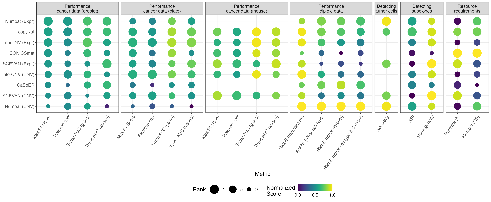

# Benchmarking scRNA-seq copy number variant callers

Katharina T. Schmid 1, Aikaterini Symeonidi 1,2, Dmytro Hlushchenko 1, Maria L. Richter 1, Maria Colomé-Tatché 1,2 (contact: maria.colome@bmc.med.lmu.de)

1 Biomedical Center (BMC), Physiological Chemistry, Faculty of Medicine, LMU Munich, Planegg-Martinsried, Germany

2 Institute of Computational Biology, Computational Health Center, Helmholtz Zentrum München, German Research Center for Environmental Health, Neuherberg, Germany


Work in progress, publication link will follow here as soon as available.

The following README contains:

1. [Project description](## Project description)
2. [Main results](## Main results)
3. [Setup of the pipeline](## Setup of the pipeline)
4. [Running the pipeline](## Running the pipeline)

## Project description

We evaluated six popular computational methods in their ability to detect CNVs in 15 scRNA-seq datasets, comprising cancer cell lines, primary cancer samples and one diploid PBMC dataset. We assessed the methods according to their ability to recover the ground truth CNVs, estimaed with (sc)WGS or WES, using a large set of performance metrics. Additionally, we explored whether they could correctly identify euploid cells, especially also in fully diploid samples, and subclonal structures in heterogeneous tumor samples. We assessed also the scalability of each method.


Assessed methods:

* CaSpER: https://github.com/akdess/CaSpER

* CONICSmat: https://github.com/diazlab/CONICS

* copyKat: https://github.com/navinlabcode/copykat 

* InferCNV: https://github.com/broadinstitute/infercnv

* Numbat: https://github.com/kharchenkolab/numbat/

* SCEVAN: https://github.com/AntonioDeFalco/SCEVAN 


## Main results

For the CNV analysis of aneuploid samples, the evaluated methods showed a very variable performance which was in large part dataset dependent (Figure 2). We identified certain dataset characteristics that impacted the performance, e.g. total coverage, number of measured cells, and the relative frequency of gains and losses.


A strong difference between methods was instead observed in the analysis of the diploid cells (T-cells from a PBMC dataset), where the choice of the reference dataset had a great effect (Figure 3). When using T-cells from the same dataset as reference, we observed good performance values for all methods. However, when we used Monocytes or T-cells from another dataset for normalization, Numbat and Casper outperformed other methods, potentially due to the inclusion of allelic information for CNV classification. 


Furthermore, the methods differ in other several other aspects (Figure 4). Numbat, SCEVAN and copyKat all include the option to automatically annotate diploid cells. The automatic performance showed a very high concordance to the manual annotations in nearly all cases, with Numbat and SCEVAN performing slightly better than copyKat. The classification of cells into different subclones worked well for all methods except CONCISmat and CaSpER. The runtime requirements for Numbat and Casper are longer, as they also estimate allele frequencies compared to the other methods, while especially CONICSmat and copyKat show both a fast runtime and little memory requirements. In the end, there is not one scRNA-seq method outperforming all other methods, but the user should choose the appropriate method for their specific tasks.



## Setup of the pipeline

All CNV callers are implemented in R. For this reason, the complete benchmarking is performed in R. The required packages were installed using this [conda environment](https://docs.conda.io/en/latest/), documented in the yaml file `conda_env_R.yml`. The environment is based on R4.1.0 and contains also `snakemake` for the benchmarking pipeline (see below).

```
conda env create -f conda_env_R.yml
conda activate r_env
```

If conda is slow in creating the environment, [mamba](https://mamba.readthedocs.io/en/latest/user_guide/mamba.html) is a great extension.

However, most of the CNV callers are only available on github. They need to be installed later into the environment, as they are not available on conda:

```
library(devtools)
install_github("JEFworks/HoneyBADGER")
install_github("akdess/CaSpER")
install_github("navinlabcode/copykat")

install_github("miccec/yaGST") # required for SCEVAN
install_github("AntonioDeFalco/SCEVAN")

install_github("diazlab/CONICS/CONICSmat")
```

Additionally, the CNV caller Numbat and the evaluation packages clevr (to calculate the homogeneity) and crfsuite (for multi-class F1 scores) are all only available on CRAN, not conda. And also for Seurat (required for preprocessing), only a very old version is available on conda. Hence, also these packages are installed directly:

```
install.packages(c('numbat','Seurat','clevr', 'crfsuite'))
```

For the CNV caller CaSpER, additionally the tool [BAFExtract](https://github.com/akdess/BAFExtract) needs to be installed.

## Running the pipeline

To systematically evaluate the different methods in different settings, a snakemake pipeline is created, with the option to benchmark the results and submit every job to the slurm cluster.

After activating the conda environment (created in `conda_env_R.yml`), the snakemake workflow `workflow.sm` can be run (given that a dataset is available at the defined locations).

```
conda activate r_env
snakemake -s workflow.sm
```

In order to run it on a slurm cluster, adapt the config file `config/slurm.json` and execute a rule as

```
nohup nice snakemake -s workflow.sm -u config/slurm.json --jobs=150 --local-cores=1 \
    --latency-wait 35 -k --cluster "sbatch --nice=10000 -t {cluster.time} -c {cluster.cpu} --mem-per-cpu {cluster.mem} \
    -p {cluster.partition}" \
    ${target} &> ${log} &
```

